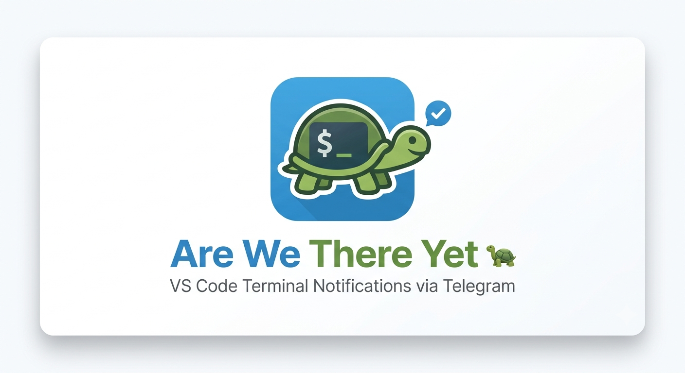
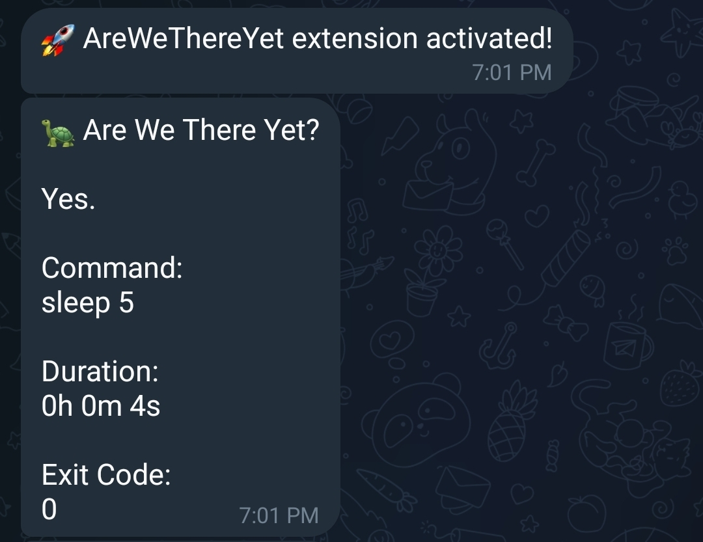

# Are We There Yet 🐢


<p align="center">
  
</p>

Get Telegram notifications when long-running terminal commands finish in VS Code.

No more tab-checking every few minutes to see whether your training script, build, test suite, or deployment has completed. Start a command, walk away, and get notified on your phone when it's done.

---

## Features

### 🚀 Terminal Command Monitoring

Automatically tracks commands executed in the VS Code integrated terminal.

### 📱 Telegram Notifications

Receive notifications directly on your phone through Telegram when commands finish.

### ✅ Success & ❌ Failure Detection

Know immediately whether a command completed successfully or failed.

Example notification:

```text
🐢 Are We There Yet?

Yes.

Status:
✅ Success

Command:
python train.py

Duration:
1h 24m 17s

Exit Code:
0
```

<p align="center">
  
</p>

### ⏱ Duration Filtering

Avoid notification spam by only sending notifications for commands that run longer than a configurable duration.

### 🧪 Test Notification Command

Verify your Telegram setup instantly from the Command Palette.

---

## Requirements

Before using the extension, you need:

1. A Telegram account.
2. A Telegram bot created using BotFather.
3. Your Telegram Chat ID.

### Creating a Telegram Bot

1. Open Telegram.
2. Search for `@BotFather`.
3. Run:

```text
/newbot
```

4. Follow the instructions.
5. Save the bot token.

### Getting Your Chat ID

Send a message to your bot.

Open:

```text
https://api.telegram.org/bot<YOUR_BOT_TOKEN>/getUpdates
```

Look for:

```json
"chat": {
  "id": 123456789
}
```

Use that value as your Chat ID.

---

## Extension Settings

This extension contributes the following settings:

### `areWeThereYet.botToken`

Telegram Bot API token used to send notifications.

Example:

```json
"areWeThereYet.botToken": "123456:ABCDEF..."
```

### `areWeThereYet.chatId`

Telegram Chat ID that will receive notifications.

Example:

```json
"areWeThereYet.chatId": "123456789"
```

### `areWeThereYet.minimumDurationSeconds`

Minimum command runtime (in seconds) before a notification is sent.

Default:

```json
"areWeThereYet.minimumDurationSeconds": 30
```

Example:

```json
"areWeThereYet.minimumDurationSeconds": 60
```

---

## Commands

### Are We There Yet: Send Test Notification

Sends a test message to verify that your Telegram integration is working correctly.

### Are We There Yet: Open Settings

Opens the extension settings page in VS Code.

---

## Example Configuration

Open **Settings (JSON)** and add:

```json
{
  "areWeThereYet.botToken": "YOUR_BOT_TOKEN",
  "areWeThereYet.chatId": "YOUR_CHAT_ID",
  "areWeThereYet.minimumDurationSeconds": 30
}
```

---

## Known Issues

- Only commands executed through the VS Code integrated terminal are monitored.
- Notifications require an active internet connection.
- Telegram must be configured before notifications can be sent.

---

## Release Notes

### 0.0.1

Initial release.

Features included:

- Telegram notifications
- Terminal command tracking
- Success/failure detection
- Duration tracking
- Configurable minimum duration filter
- Test notification command
- Settings integration

---

## Following Extension Guidelines

This extension follows the Visual Studio Code Extension Guidelines:

https://code.visualstudio.com/api/references/extension-guidelines

---

## Feedback & Contributions

Issues, feature requests, and pull requests are welcome.

If you've ever left a model training run, test suite, or deployment running and wondered:

> "Are we there yet?"

This extension is for you. 🐢